# PCB-Designs

### 1. Battery Management Systems - BMS

The BMS PCB is responsible for the voltage and temperature measurements of each battery cell of the system. The LTC6811 IC from Analog Devices is used for each segment of the battery pack and the schematic circuit along with the PCB in 3D view are presented below.

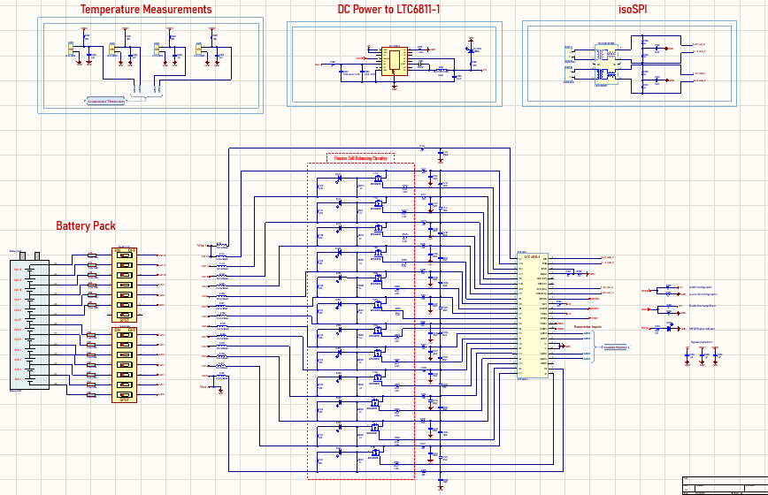
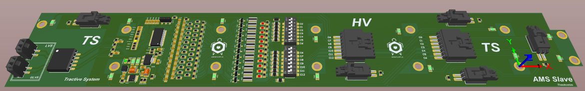

### 2. Brake System Plausibility Device - BSPD PCB

The BSPD PCB is a safety circuit which disables the HV Power Supply of the motors controller in case the driver presses simultaniously the gas pedal and the brake pedal very hard. It consists of some active analog filters that filter the input signals of the sensors, the there are some comparators and then some digital logic that controls the relay switch that enables and disables the HV system. The schematic of the circuit is shown below.

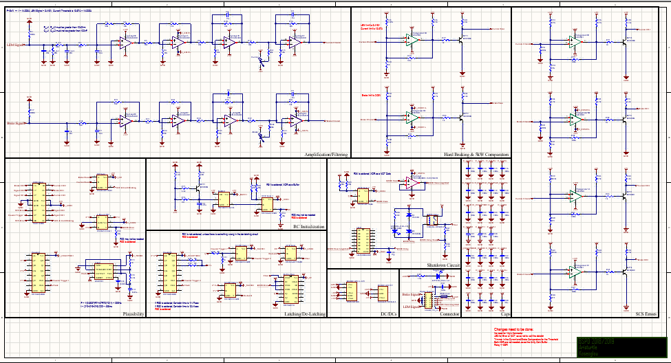

The PCB layout of both sides and the 3D view.

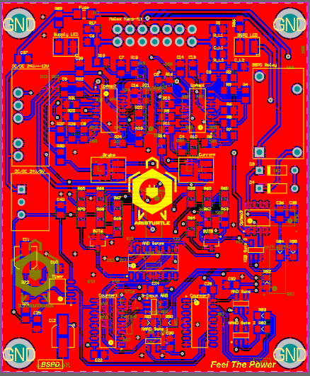
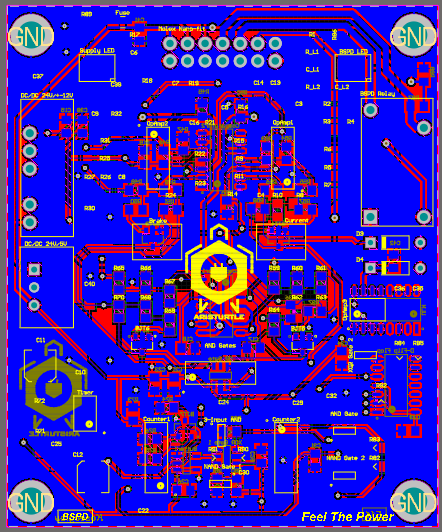

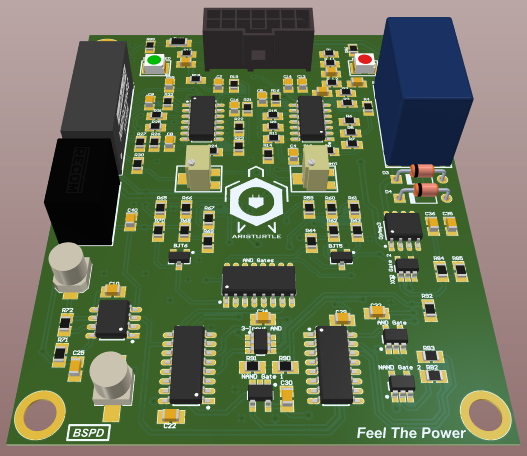
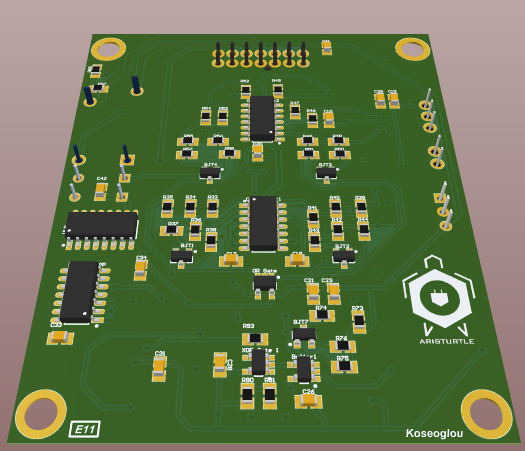

### 3. STM Microcontroller PCB

An MCU PCB based on the STM32F446RET6U IC is integrated in 3 different places of the car and the schematic circuit along with the PCB in 3D view are presented below.

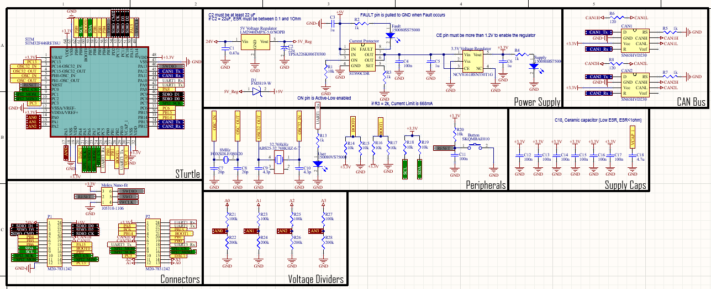
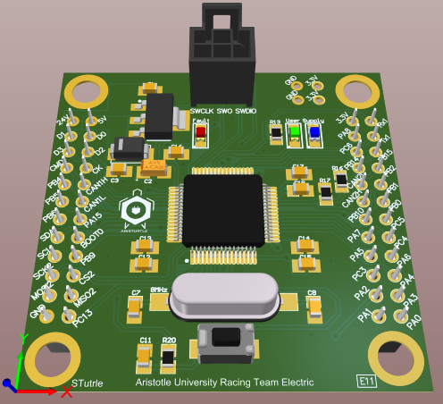
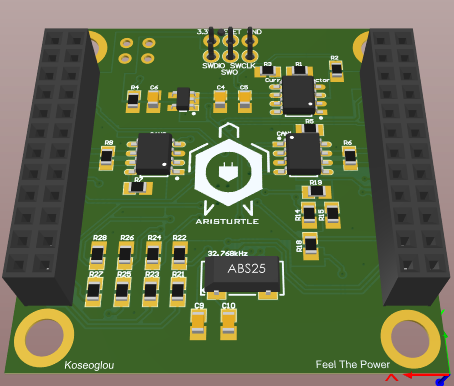

### 4. Auxiliary PCB

Auxiliary PCB is used as a supplementary power supply PCB. It is supplied by the low voltage system with 24V, and it is responsible to provide all the necessary voltage levels for the operation of the vehicle. The schematic circuit along with the PCB in 3D view are shown below.

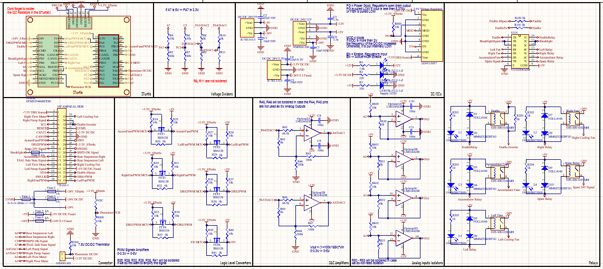
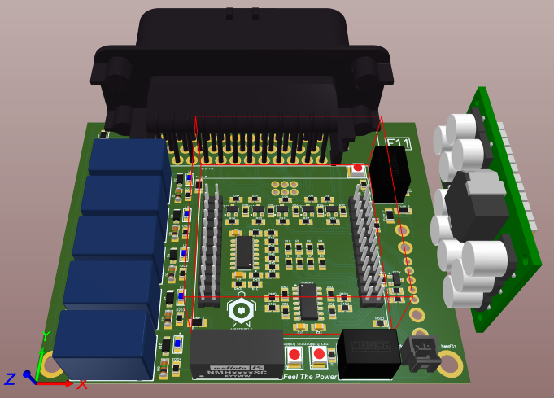
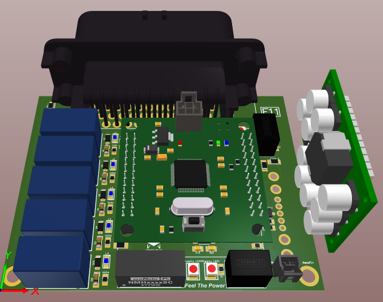

### 5. Fusebox PCB

The Fusebox PCB is the main PCB of the Battery Pack and it consists of the Insulation Monitoring Device (IMD), the precharge and discharge circuit for the DC-Link capacitors of the motor controllers, the Master IC of the BMS and the Battery Pack Led Indicator power supply as well as some other necessary circuit for the operation of the vehicle. The schematic circuit along with the PCB in 3D view are presented below.

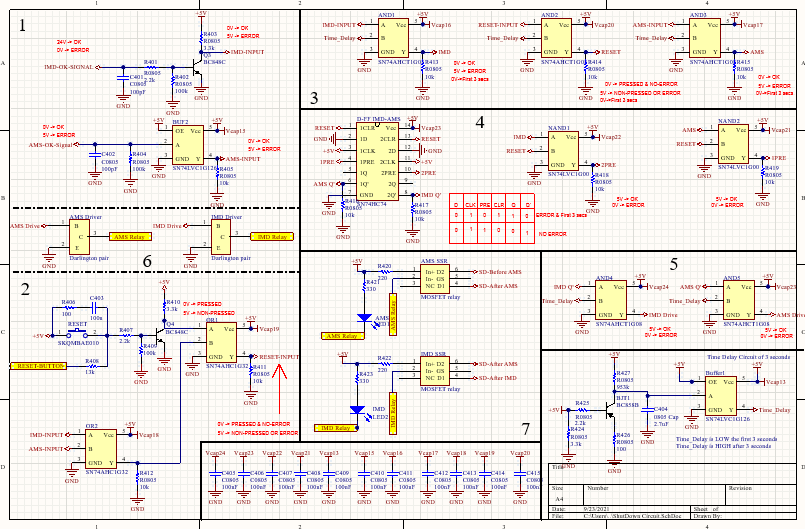
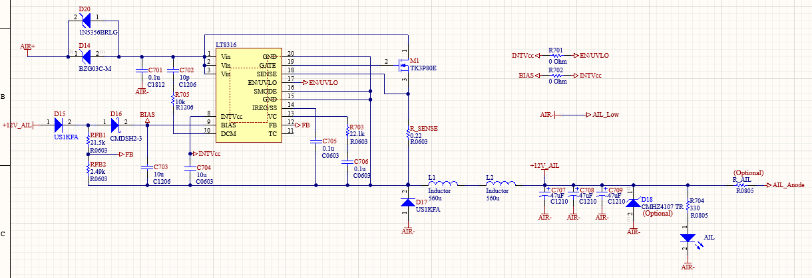
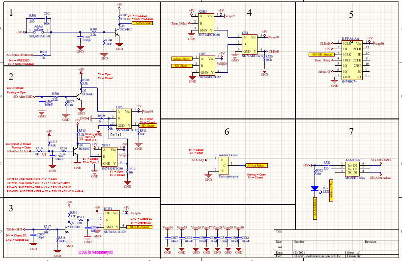
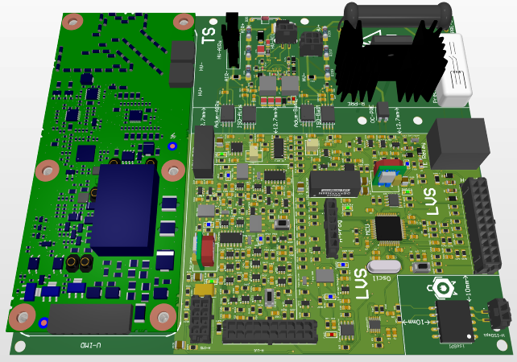

