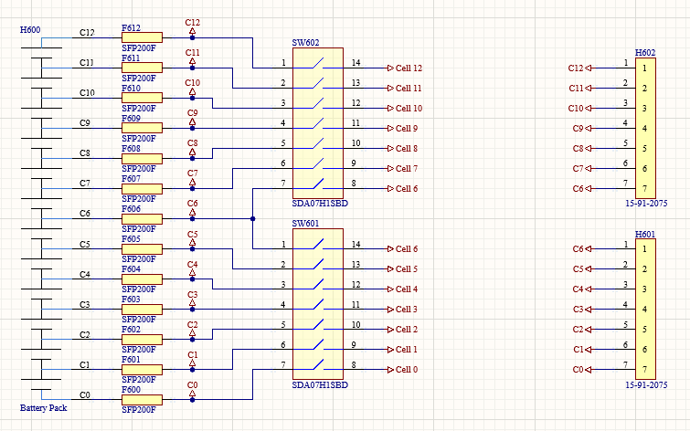

# PCB-Designs

### 1. Battery Management Systems - BMS

### 2. Brake System Plausibility Device - BSPD PCB

The BSPD PCB is safety circuit which disables the HV Power Supply of the motors controller in case the driver presses simultaniously the gas pedal and the brake pedal very hard. It consists of some active analog filters that filter the input signals of the sensors, the there are some comparators and then some digital logic that controls the relay switch that enables and disables the HV system. Here it shown the schematic of the circuit.

The PCB layout of both sides and the 3D view.

### 3. STM Microcontroller PCB

This is a PCB that is integrated in 3 different places of the car since it is the MCU STM32F446RET6U.

### 4. Auxiliary PCB

### 5. Fusebox PCB

### 6. Precharge Circuit Testing PCB

### 7. Custom Battery Tester (Internal Resistance Measuremet)

### 8. Battery Charger PCB

